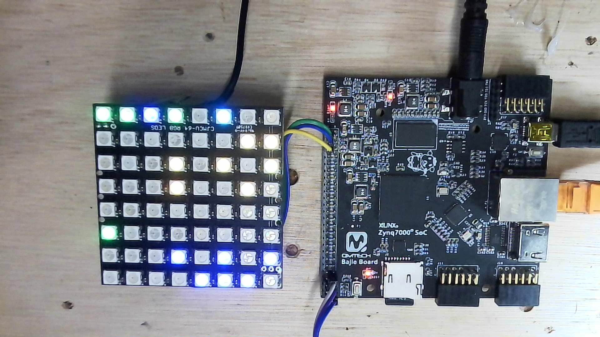

# PDP-11/44 on the QMTECH Zynq-7010 "Bajie" board

## Credits

[Sytse van Slooten](https://pdp2011.sytse.net/) wrote the pdp2011 core this
whole project is built on. Usagi Electric and Dave Plummer on YouTube were the
spark for wanting a real PDP-11 running again in the first place.

A port of the [pdp2011](https://pdp2011.sytse.net/) VHDL core (PDP-11/44,
22-bit MMU, RL11 disk on microSD) to a Zynq-7010. Main memory lives in the
PS's DDR3, shared with a PetaLinux system running on the same chip.

The board boots PetaLinux on the ARM cores and the PDP-11 side at the same
time; the PDP-11 boots whatever's on the RL0/DB0 image currently loaded (see
"Swapping disks without a reboot") — RT-11 V5.3, RSX-11, and 2.11BSD (over the
RH11/RP06 bridge) have all booted on this board. Part `xc7z010clg400-1`,
toolchain Vivado 2023.2 + PetaLinux 2023.2.

The primary console (`kl0`) uses physical FPGA pins; three more (`kl1`-`kl3`)
are bridged to Linux over `/dev/ttyUL*` (see "Serial consoles and TU58"
below). The RL11 disk started on a physical SD (`sdspi.vhd`) and was later
moved to an image file on the PS served over AXI — see "File-backed RL disk"
below.

## Memory sharing

The PDP-11 and PetaLinux share the board's 512 MB DDR3. The top 8 MB
(`0x1F800000`–`0x1FFFFFFF`) is carved out for the PDP-11; a `no-map`
`reserved-memory` node keeps Linux out of it.

- `ddr_mem.vhd`'s `ddr_base` is `0x1F800000`. The core's full 4 MB (22-bit)
  space maps to `0x1F800000`–`0x1FBFFFFF`, the bottom half of the carve-out.
- The top half (`0x1FC00000`–`0x1FFFFFFF`) is unused headroom. The core can't
  address past 4 MB without widening its unibus, but reserving 8 MB now avoids
  a device-tree change later.

## Physical pins

Pin assignments are user-supplied and not cross-checked against a board
schematic; `IOSTANDARD` is `LVCMOS33` on all of them. Re-verify if the console
or SD card don't come up.

| Signal | Pin | Notes |
|---|---|---|
| console tx | P20 | 9600 8N1, KL11 `kl0` |
| console rx | T19 | |
| SD MISO | N20 | idle/unused — RL11 and RH11/RP06 are both AXI file-backed now (see "File-backed RH/RP06 disk") |
| SD CLK | R19 | idle/unused, same reason |
| SD MOSI | T20 | idle/unused, same reason |
| SD CS | V20 | idle/unused, same reason |
| LED | H17 | active-low bring-up blink |
| NeoPixel data | T11 | 8x8 WS2812 front panel |
| reset button | U15 | PDP-11-only reset, active-low |

## Serial consoles and TU58

The core is built `have_kl11 => 4`. `kl0` is the physical console on P20/T19.
The other three (`kl1`/`kl2`/`kl3`, RT-11 `TT1:`/`TT2:`/`TT3:`) are wired
back-to-back with an `axi_uartlite` each, inside the fabric: KL11 `tx` to
uartlite `rx`, uartlite `tx` to KL11 `rx`. Each link is real async serial, so
the uartlite baud must match the KL11's. Linux sees each uartlite as a
`/dev/ttyUL*`, so opening that port is the same as sitting at that PDP-11
terminal.

| Linux dev | uartlite | IRQ | Baud | KL11 (addr/vec) | RT-11 |
|---|---|---|---|---|---|
| `/dev/ttyUL1` | `0x42000000` | 39 | 19200 | `kl1` 776500 / 300 | `TT1:` |
| `/dev/ttyUL2` | `0x42010000` | 40 | 9600 | `kl2` 776510 / 310 | `TT2:` |
| `/dev/ttyUL3` | `0x42020000` | 41 | 9600 | `kl3` 776520 / 320 | `TT3:` |

The uartlites sit on `M_AXI_GP0`, alongside the reset/debug GPIOs and the RL/RH
disk backends below (7 masters on that interconnect as of the RH bridge).
The 6.1 uartlite driver has no polled mode: with interrupts unwired it fails at
probe with `IRQ index 0 not found`, so each `interrupt` goes to the PS through
an `xlconcat` into `IRQ_F2P` (`PCW_USE_FABRIC_INTERRUPT` and `PCW_IRQ_F2P_INTR`
enabled in the PS7 config). The `Runtime PM usage count underflow` line at probe
is cosmetic. Kernel side: `CONFIG_SERIAL_UARTLITE=y`, `NR_UARTS=4` via
`bsp.cfg`, no getty on the `ttyUL*`.

The uartlite baud is fixed in hardware, so the Linux-side `stty` baud is
ignored — just open the port.

`tu58fs` ([github.com/RichardPar/tu58fs](https://github.com/RichardPar/tu58fs))
is in the rootfs. It emulates a TU58 DECtape II over serial; point it at one of
the `ttyUL*` ports to give the PDP-11 a `DD:` tape. `picocom` is also included
for talking to the ports. Both are recipes under the PetaLinux project;
`tu58fs` is a pinned-commit git recipe with a Makefile override so it
cross-compiles for ARM.

RT-11 as shipped prints "No multi-terminal support", so `TT1:`–`TT3:` aren't
serviced by the OS yet — that needs a SYSGEN'd multi-terminal monitor (see "Not
done").

## ddr_mem.vhd

Same contract as `psram_bridge.vhd`: it owns `cpuclk` and `cpureset` for the
unibus core and generates `cpuclk`. The KL11 baud generator and `sdspi` bit
clock run off the separate free-running `clk50mhz` (FCLK1), not `cpuclk`.

DDR3-over-`S_AXI_HP0` latency isn't fixed, so it's a handshake-driven AXI4
master FSM rather than a fixed-cycle counter. Read data (`dati`) and the rising
edge of `cpuclk` must not change on the same underlying clock edge, or reads
occasionally return the previous value; the `st_read_settle` state gives `dati`
a full settle cycle before `cpuclk` rises.

`cpureset` is synchronous to `cpuclk` in the core (`r7`/PSW load on a rising
`cpuclk` edge while reset is asserted). So `cpuclk` free-runs from the start and
`cpureset` drops only after ~63 clean edges — matching `psram_bridge.vhd`. An
earlier version held `cpuclk` low through reset and released it too early, so
the CPU never actually reset and never fetched (see "Bring-up notes").

`S_AXI_HP0` is 32 bits wide, so each AXI word holds two PDP-11 words: `addr(1)`
picks the half, `addr(0)` with `control_datob` picks the byte. Routed through an
`axi_protocol_converter` (AXI4 to AXI3) since Zynq-7000 HP ports are AXI3-only.

## PDP-11-only reset

A 1-bit `axi_gpio` (`axi_gpio_reset` at `0x41200000` on `M_AXI_GP0`) is inverted
and ANDed with `peripheral_aresetn`; that drives `zynq_top_0`'s `aresetn`.
Pulsing the bit resets only the PDP-11 core and its DDR bridge, leaving
`S_AXI_HP0`, the protocol converter, and the rest of the fabric alone. The U15
button does the same thing in hardware, which still works if the AXI fabric
itself is wedged.

`pdp11_reset.sh` (`petalinux/meta-user/recipes-apps/pdp11-scripts/files/`,
installed to `/usr/bin` by the `pdp11-scripts` recipe) pokes the register
directly with `devmem`.

A subtlety this reset has to handle: `S_AXI_HP0` is on the PS reset domain and
does **not** reset with this scoped reset, so `ddr_mem` holds `bready`/`rready`
high through reset to drain any in-flight HP0 response — otherwise an un-acked
response desyncs HP0 and the CPU freezes on its next memory access after the
reset. (Symptom before the fix: a scoped reset re-read only a few disk blocks
then halted; only a full power-cycle recovered.)

## File-backed RL disk (default)

The RL11's backing store is an **image file on the PS**, served by a Linux
daemon over AXI — not a physical SD card. `rl11.vhd` is unchanged; its `sdspi`
instance is swapped for **`sddisk.vhd`**, a drop-in with the same block
interface (`sdcard_addr`, the read/write handshake, the 256-word sector buffer)
but an **AXI-Lite slave + interrupt** backend instead of bit-banged SPI. It's
threaded up `rl11 -> unibus -> zynq_top -> block design` and lives at
`0x43000000` on `M_AXI_GP0` (interrupt on `IRQ_F2P[3]`). Register map:

| Offset | Meaning |
|---|---|
| `0x000`-`0x3FC` | PL sector buffer (write = deliver read data, read = fetch write data). The core uses the low 128 words = one 256-byte RL02 sector; the upper half is zero-padded. |
| `0x800` | STATUS: bit0 = request pending, bit1 = is_write |
| `0x804` | BLOCK: 24-bit block number (`image byte = block * 256`) |
| `0x808` | DONE: daemon writes when the transfer completes (bit0 = error) |

An RL02 sector is really 256 bytes (128 words). The original author padded each
one out to a 512-byte SD block so it lined up with a physical card; on a file
that padding is dead weight, so `pdp11-diskd` serves the native 256 (`BLOCK *
256`, low 128 words). Half the size, half the I/O — and it makes the image a
plain RL02 `.dsk`, with consecutive sectors adjacent so RT-11's 512-byte blocks
are contiguous. Nothing in the VHDL changed, just the daemon.

**`pdp11-diskd`** (a UIO daemon, recipe in `meta-user/recipes-apps`) waits on
the interrupt, `pread`/`pwrite`s the image, and moves the sector through the
buffer. It's exposed as a UIO device via `system-user.dtsi` (`&zynq_top_0` ->
`compatible = "generic-uio"`, `linux,uio-name = "pdp11disk"`), the kernel's
`CONFIG_UIO`/`UIO_PDRV_GENIRQ`, and the bootarg
`uio_pdrv_genirq.of_id=generic-uio`. It auto-starts at boot (SysV init) with
`-r`, which pulses the PDP-11-only reset once the daemon is serving so a cold
boot comes straight up into RT-11 from the file.

**Geometry:** each RL unit is 40960 sectors = **10 MB** (a standard RL02 `.dsk`).
The `BLOCK` register is a linear sector index across units; the daemon splits it
into `unit = BLOCK / 40960` and `local = BLOCK % 40960`, and serves **each unit
from its own image file** (`pdp11-diskd … /srv/pdp11/dl0.img /srv/pdp11/dl1.img`
— positional args map to DL0, DL1, …). So DL0 and DL1 are two separate 10 MB
files now, not one blob. Only two are usable anyway; DL2/DL3 hang the core (see
"Not done").

`rk11` is still wired to `sdspi.vhd` but off. `rh11` is now on as an RP06
(`have_rh => 1`, `rh_type => 6`), served the same way as RL11 — its own
`sddisk.vhd` AXI bridge, backed by an image file on the PS — see "File-backed
RH/RP06 disk" below.

## Swapping disks without a reboot

`pdp11-diskd` runs a small REST API (port 8080 by default) so you can pull an
image out of a unit and drop a different one in while RT-11/2.11BSD keeps
running — swap between an RT-11 pack, a games pack, XXDP, an RP06 pack,
whatever, without touching the board. Covers both busses, RL11 (DL0..DL3) and
RH11/RP06 (DB0 only): `GET /status`, `GET /images` (what's in `/srv/pdp11`),
`POST /load?unit=<spec>&path=...`, `POST /unload?unit=<spec>`. `<spec>` is a
bus+unit like `rl0`/`rh0`, or a bare number, which still means RL (`unit=1` ==
DL1) for backward compatibility.

Raw curl works, but there are wrappers. On the board, `dlctl` (ships with the
`pdp11-diskd` recipe, which pulls in `curl`):

```
dlctl status
dlctl list
dlctl load 1 games.img         # bare name is resolved under /srv/pdp11 -> DL1
dlctl unload 1
dlctl load rh0 rp06-2.11bsd.img
```

From the dev host, `scripts/dlctl.sh` does the same over the network and can push
an image across first:

```bash
./scripts/dlctl.sh status
./scripts/dlctl.sh push  ~/disks/games.img      # -> board:/srv/pdp11/games.img
./scripts/dlctl.sh swap  1 ~/disks/games.img    # push then load into DL1
./scripts/dlctl.sh unload 1
./scripts/dlctl.sh load  rh0 rp06-2.11bsd.img
```

Or hit the API directly:

```bash
curl board:8080/status
curl 'board:8080/load?unit=1&path=/srv/pdp11/games.img'
curl 'board:8080/unload?unit=1'
curl 'board:8080/load?unit=rh0&path=/srv/pdp11/rp06-2.11bsd.img'
```

A swap is atomic against disk I/O — the daemon holds a lock across each sector
transfer, so a load can't land in the middle of one. The RT-11/2.11BSD side has
two rules, though:

- **Don't swap DL0/DB0.** They're the system devices RT-11/2.11BSD run from
  (monitor, handlers, USR overlays get read back constantly), so pulling one
  crashes the machine. Swap DL1 and up only; DB0 is the only RH unit anyway.
- **Swap a unit only when nothing has a file open on it.** RT-11/2.11BSD
  re-read the directory on every access and have no write-back cache, so once
  the unit's idle the next access just sees whatever you loaded — there's
  nothing to flush.

There's no "unmount" step: `MOUNT`/`DISMOUNT` in RT-11 are the LD (logical disk)
handler's, for mounting a file as a virtual drive, not anything a physical `DLn:`
uses. `-p` changes the port (`-p 0` turns the API off), `-D` points `/images`
somewhere other than `/srv/pdp11`.

Every load/unload gets written to a persistent config file (`-c`, default
`/srv/pdp11/diskd.conf`) and replayed on the daemon's next start, so a swap
survives a reboot instead of reverting to the init script's seed images.

(Fixed bug: `pdp11-diskd` used to refuse to start at all with RL0 unloaded —
a leftover check from its RL-only days. Unloading DL0/DL1 to boot RP06 is a
normal persisted state now, so that check is gone.)

## File-backed RH/RP06 disk

RH11/RP06 (`DB:` at 0176700, vector 254) works the same way RL11 does: its
`sdspi` instance is swapped for its own **`sddisk.vhd`** (a second, separate
instance of the same bridge — each disk gets one), backed by an image file on
the PS via `pdp11-diskd`. RH11's sector is a native 512-byte/256-word block,
so unlike the RL11 there's no 256→512 padding to undo. Lives at `0x43010000`
on `M_AXI_GP0`, interrupt on `IRQ_F2P[4]`, same register map as the RL bridge
above. The core only implements one RH drive — `rh11.vhd`'s busmaster logic
is explicit about it ("there is one drive only") — so it's DB0, no DB1.

Gotcha that cost a rebuild cycle: Vivado's device-tree generator dumps *both*
of zynq_top_0's AXI-Lite interfaces onto the same node — one `reg` (the RL
region only), but both interrupts concatenated into it. `uio_pdrv_genirq`
only maps the region that's actually there and only claims `interrupts[0]`,
so the RH side was in the DT but bound to nothing. Fixed with a hand-added
second node in `system-user.dtsi` for the RH region, reusing the interrupt
cell Xilinx's generator already computed for it rather than trying to derive
it — if the BD's IRQ_F2P wiring ever moves, that value goes stale silently;
see the comment on the node for how to refresh it.

## Auto-boot ROM: rk/rl/rp fallover

`bootrom => boot_pdp2011` (`zynq_top.vhd`) tries controllers in order rk, rl,
rp: for each it first checks the controller's CSR responds on the bus at all
(a UNIBUS-timeout trap through vector 4 skips straight to the next one if not),
then attempts an actual read. Up to 2026-08-14 a real read error (device
present but nothing usable, e.g. an unloaded `pdp11-diskd` unit) didn't fall
through — it just `reset` and retried the *same* device forever. Fixed
2026-09-03: `rkgo`/`rlgo`/`rpgo`'s error paths in
`vivado/pdp2011_core/core/m9312h-pdp2011.mac` now jump to the next device's
probe instead (rk error -> `nork`/try rl, rl error -> `norl`/try rp, rp error
-> `boot`/wrap to rk), confirmed on hardware per the RH/RP06 section above. The
`.mac` source lives next to the compiled `m9312h-pdp2011.vhd`; rebuilding it
needs upstream's `macro11`/`genblkram` toolchain (from
`pdp2011.sytse.net`'s download tarball, not vendored in this repo).

## Building

Everything is built by the top-level **`./build.sh`** — bitstream, then the full
PetaLinux (kernel, rootfs, `BOOT.BIN`), including the rootfs apps `pdp11-diskd`,
`tu58fs`, `picocom`, and `pdp11-scripts`. All artifacts land in `deploy/`.

```bash
# prerequisites (see below), then:
./build.sh                 # bitstream, then PetaLinux, from scratch
./build.sh bitstream       # Vivado only
./build.sh petalinux       # PetaLinux only (needs deploy/*.xsa already)
```

**Prerequisites**

- **Vivado 2023.2**. If it isn't at `~/Xilinx/Vivado/2023.2`, set `VIVADO=/path/to/Vivado/2023.2`.
  `build.sh` auto-adds the `libtinfo.so.5` shim Vivado 2023.2 needs on modern
  distros (no root required).
- **Docker**, with your user in the `docker` group.
- The **PetaLinux 2023.2 installer** `.run`. Point to it with
  `PLNX_INSTALLER=/path/...` or drop it beside/inside the project — `build.sh`
  finds it. (PetaLinux 2023.2 won't build natively on a modern glibc-2.39 host —
  its `fakeroot` breaks — so the build runs inside an Ubuntu-22.04 container; see
  `docker/`.)

The two stages individually:

- **Vivado** — the four TCL scripts in `vivado/scripts/` (create project, block
  design, constraints, synth/impl/bitstream) → `deploy/pdp2011_zynq.bit` +
  `pdp2011_zynq_wrapper.xsa`.
- **PetaLinux** — `docker/plnx.sh {image|install|build}`. Incremental helpers:
  `rehw` re-imports a new XSA (e.g. after adding PL IP) and rebuilds; `rebuild`
  builds the existing project; `package` repackages `BOOT.BIN` with a new
  bitstream and no full rebuild. Paths are overridable via `PLNX_INSTALL` /
  `PLNX_WORK`. See `docker/README.md`.

### PetaLinux customizations

In `project-spec/meta-user`:

- `system-user.dtsi` — `reserved-memory pdp11ram@1f800000`, `no-map`,
  `reg = <0x1f800000 0x800000>`.
- `pdp11-scripts` recipe — installs `pdp11_reset.sh`.
- `tu58fs` and `picocom` recipes, plus `bsp.cfg` enabling
  `CONFIG_SERIAL_UARTLITE`.
- rootfs on the SD's ext4 partition (`root=/dev/mmcblk0p2`), not initrd.

## Deploying

There is a **single SD card** — the PS boot card. Both PDP-11 disks are files
on the PS now (RL at `/srv/pdp11/dl0.img`/`dl1.img`, RH0/RP06 at
`/srv/pdp11/db0.img`), so no separate disk card is needed.

The boot card has two partitions: FAT32 (`BOOT.BIN`, `image.ub`, `boot.scr`) and
ext4 (rootfs). `scripts/flash_sd_card.sh` writes a fresh card. Then place the
disk images under `/srv/pdp11/` on the rootfs (each RL unit is a 10 MB
`.dsk`, `db0.img` is ~166 MB); `pdp11-diskd` auto-starts at boot, resets the
PDP-11, and serves them (see "File-backed RL disk" / "File-backed RH/RP06
disk"). After the first boot it remembers whatever's loaded where in
`/srv/pdp11/diskd.conf` — see "Swapping disks without a reboot" — so these are
just the seed images for a fresh card, not something you keep hand-managing.

The board is normally reachable over the network, so `scripts/`
has helpers that update a running board in place:

- `flash_bootbin_net.sh` — replace `BOOT.BIN` on the FAT partition.
- `deploy_petalinux_net.sh` — replace `image.ub`/`boot.scr`.
- `program_jtag.tcl` — load a bitstream into the PL over JTAG (boot the current
  SD first so the FSBL brings up the PS clocks and DDR).

`scripts/rl0_boot.sh` deposits an RL bootstrap over ODT to boot the PDP-11 disk
if it's not set to auto-boot.

## Bring-up notes

Host setup on Linux Mint 22: `scripts/setup_host.sh` installs the PetaLinux
packages, points `/bin/sh` at bash, and installs the JTAG cable drivers;
`scripts/fix_libtinfo.sh` adds the `libtinfo.so.5` shim; `scripts/fix_build_memory.sh`
adds swap and overcommit for the Yocto build.

The first hardware test had a dead console: `cpuclk` was running but `ifetch`
never toggled. Cause was the `ddr_mem.vhd` reset described above — the CPU was
never actually reset. With that fixed, RT-11 boots to the `.` prompt, the DDR
bridge serves the full 4 MB (read and write), and PetaLinux boots alongside from
the ext4 rootfs with the DDR carve-out reserved.

The 8x8 WS2812 panel on T11 is a front-panel display: row 0 is status (RUN,
clock, fetch, read, write, I/O, DMA, heartbeat), rows 1–3 the address register,
4–5 data, 6–7 the PC. It snapshots at 4 Hz with a 1 Hz heartbeat. The CJMCU-64
is row-major, so the chain-to-pixel map is the identity.



## Repository layout

```
build.sh             top-level build: bitstream + PetaLinux -> deploy/
HISTORY.md           reverse-chronological log of milestones
vivado/
  pdp2011_core/
    core/              pdp2011 core VHDL (+ sddisk.vhd, the AXI disk backend)
    zynq_top.vhd       top level: unibus + ddr_mem + KL11s + panel
    ddr_mem.vhd        PDP-11 bus <-> S_AXI_HP0 DDR3 bridge
    neopixel_driver.vhd  WS2812 driver
  scripts/
    ps7_config_dict.tcl  PS7 config (DDR3/MIO + FCLK/HP0/IRQ_F2P overrides)
    01..04_*.tcl         project / block design / constraints / build
    program_jtag.tcl     load a bitstream over JTAG
    pdp2011_zynq.xdc     pin constraints
docker/
  Dockerfile, plnx.sh, README.md   Dockerized PetaLinux build (portable paths)
scripts/
  setup_host.sh, fix_libtinfo.sh, fix_build_memory.sh   host setup
  flash_sd_card.sh, flash_bootbin_net.sh, deploy_petalinux_net.sh   deploy
  rl0_boot.sh, rp06_boot.sh, rh11_probe.sh   runtime helpers
disks/
  rtv53_sd.img, xxdp25_sd.img   RL02 images (served by pdp11-diskd as dl0.img/dl1.img)
  211bsd-rp06.img                RP06 image (served as db0.img, see "File-backed RH/RP06 disk")
deploy/
  pdp2011_zynq.bit, pdp2011_zynq_wrapper.xsa   Vivado output
  BOOT.BIN, image.ub, boot.scr, rootfs.tar.gz  PetaLinux output
```

The PetaLinux app recipes (`pdp11-diskd`, `tu58fs`, `picocom`, `pdp11-scripts`),
kernel config, and device-tree overrides live in the PetaLinux project's
`project-spec/meta-user`, which `build.sh`/`docker/plnx.sh` create and build
outside this tree (default `../.petalinux-docker/work`, overridable).

## Not done

- **RT-11's `DB:` handler.** RP06 boots 2.11BSD fine over the AXI bridge (see
  "File-backed RH/RP06 disk" above), but nobody's tried RT-11 reading/writing
  `DB:` yet — only the boot path and 2.11BSD have exercised the bridge so far.
- **More than 2 RL units.** DL0/DL1 work; `INIT DL2:`/`DL3:` don't. RT-11's `DL`
  handler ships built for two units (`DL$UN=2`), and even after patching that to
  four the core hangs on unit 2/3 — so the SD disk path really only does two.
- **RT-11 multi-terminal.** `TT1:`–`TT3:` need a monitor SYSGEN'd with
  multi-terminal support and the extra line CSR/vectors (776500/300, 776510/310,
  776520/320). The serial paths work; the OS side doesn't service them yet.

## FP11 floating point

On (`have_fp => 1` in `zynq_top.vhd`). It was forced off on the earlier build
to save space, but the 7010 doesn't notice — the whole design lands around
39 % of the LUTs with the FPU in, and still makes timing. An 11/44 ships with
an FP11 anyway, so this just stops forcing it off.
